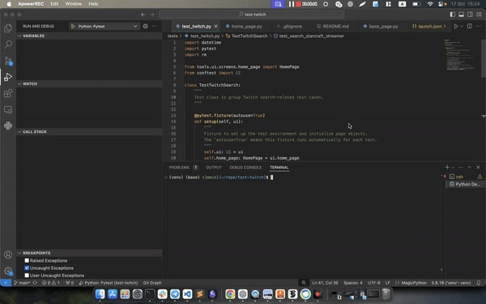

# Test-Twitch

## 1. Install Dependencies

1. Create and activate a virtual environment:
   ```bash
   python -m venv venv
   source venv/bin/activate  # On Windows: venv\Scripts\activate
   ```

2. Install dependencies:
   ```bash
   pip install -r requirements.txt
   ```

## 2. Running Tests

You can run tests by specifying the required arguments from the command line or using the device configuration file.

### Run from Command Line:
```bash
pytest --environment=staging --device_name="iPhone X" --is_local
```

- `--environment`: The environment to run tests (`staging`, `production`). staging by default
- `--device_name`: The device to use for mobile emulation (e.g., `"iPhone X"`).
- `--is_local`: Flag to run the test locally (default is `True`).

### Run with Devices from Config:
If no device is specified, the tests will pull devices from `config/devices_config.json`.

```bash
pytest --environment=staging --is_local
```

## 3. Project Structure

```
.
├── config
│   ├── devices_config.json         # JSON config for devices
│   ├── environment_config.json     # Environment-specific configurations (URLs, etc.)
├── tests
│   └── test_twitch.py              # Test cases for Twitch UI
├── tools
│   └── ui
│       ├── base
│       │   ├── browser.py          # Browser setup for tests
│       │   └── base_page.py        # Base page object model
│       └── screens
│           └── home_page.py        # Home page object model for Twitch
├── conftest.py                     # Pytest configurations and fixtures
├── requirements.txt                # Dependencies for the project
└── README.md                       # Project documentation
```